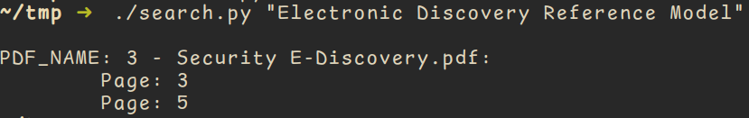

# pdf-searcher
Python script to parse through "readable" pdf's and print the search results along with page numbers!

## Usage
- chmod +x search.py
- Make sure there's a directory known as `target` in the same directory from where you run the script
- Add your target pdf's in the `target` directory
- run `./search.py <key-to-search>`

## Screenshot

